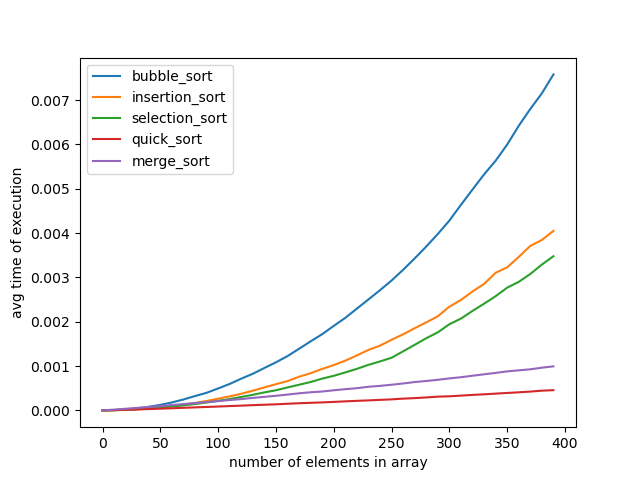

# Sorting Comparison
Compare the actual runtime of common sorting algorithms on your system for various input sizes.

**NOTE:** For accurate results, close applications and background overheads on your system.

Install the required libraries
```
$ pip install -r requirements.txt
```

Generate a file containing random numbers which will be sorted.
```
$ python random_generator.py
```

This will create a file `randoms.txt` containing `1000` lines of `400` unsorted numbers separated by commas.

```
$ python sort_comp.py
```

**NOTE:** During code execution do not start or run other applications.

## Result



For more inference, check out, 
https://wp.me/pa3wrJ-a
